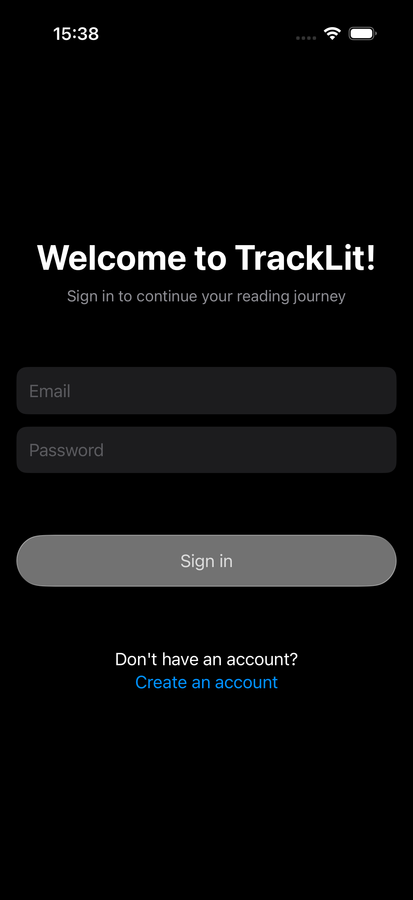
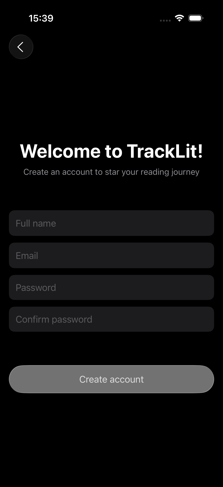
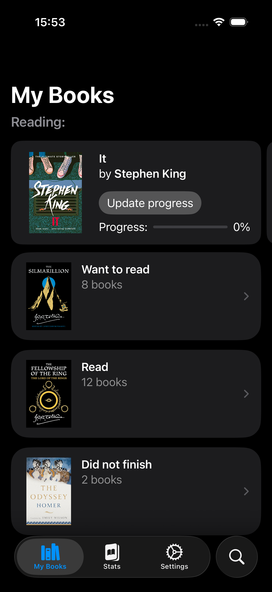
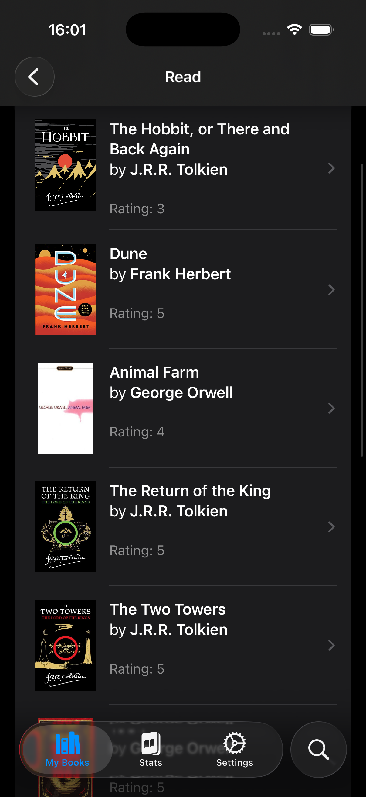
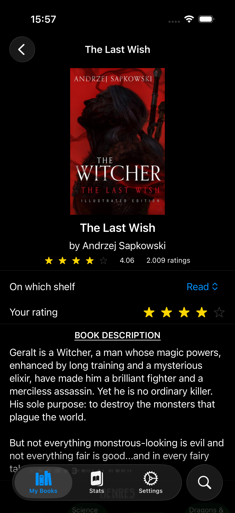
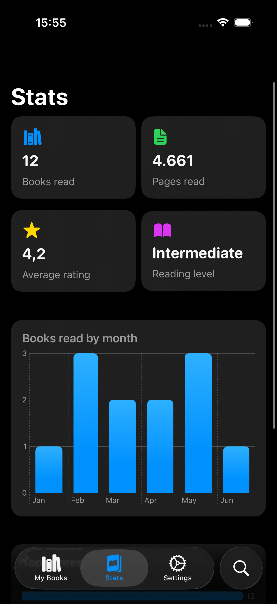
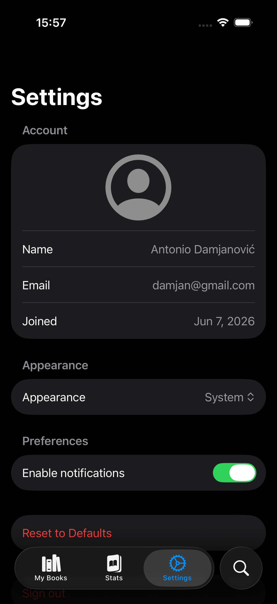
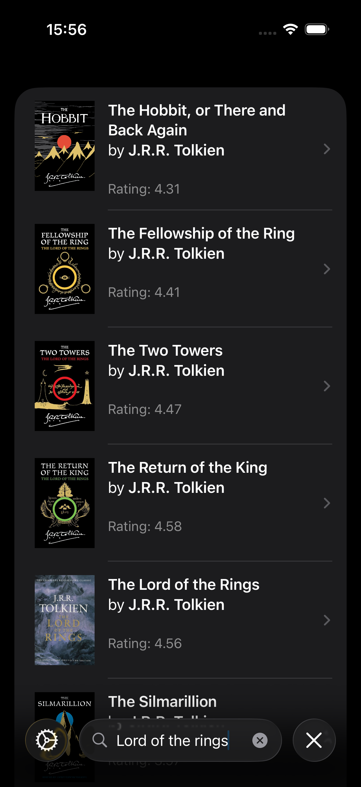

# 📚 TrackLit – iOS App with Hardcover API + Firebase

**TrackLit** is an iOS app for readers who want to keep their library in one place.
Search the Hardcover catalog, drop books on shelves, log progress as you read, and watch your reading stats grow — all backed by Firebase so your library follows you across devices.

---

## 📸 Screenshots

  
  
  
  

  
  
  
  

---

## ✨ Features
- **🔐 Auth via Firebase** – Sign up and sign in with email & password
- **🏠 My Books Screen** – Currently Reading carousel + every other shelf at a glance
- **🔎 Search Screen** – Live Hardcover GraphQL search with debounced input
- **📖 Book Detail Page** – Cover, author, rating, description, genres, moods, content warnings
- **🗂️ Shelf Management** – Currently Reading, Want to Read, Read, Did Not Finish, Not on Shelf
- **📊 Reading Progress** – Update current page or mark a book as finished in one tap
- **⭐ Ratings** – Rate books 1–5 stars from the detail screen or finish flow
- **📅 finishedAt Stamp** – Books moved to *Read* are timestamped (and cleared if you move them off)
- **📈 Stats Dashboard** – Books read, pages read, average rating, reading level
- **📉 Charts** – Top genres + Books read by month (Swift Charts)
- **🔔 Notifications** – Local push when you finish a book, reach a new reading level and daily reminders to read
- **🌗 Appearance** – System / Light / Dark theme picker stored in UserDefaults
- **📷 Profile Photo** – Capture a profile picture straight from the camera
- **🎨 Modern UI** – Built 100% in SwiftUI with the new Observation framework

---

## 🛠️ Tech Stack

- **Swift 6** – Primary language
- **SwiftUI** – Declarative UI toolkit (iOS 26)
- **Observation** – `@Observable` view models for performant state tracking
- **Swift Concurrency** – `async` / `await`, structured `Task`, `@MainActor`
- **Swift Charts** – Bar charts for monthly reads and genres
- **Firebase Auth** – Email/password authentication
- **Cloud Firestore** – Codable round‑trip via `setData(from:)` / `data(as:)`
- **URLSession** – GraphQL POST requests to the Hardcover API
- **UserNotifications** – Local notifications when a book is finished

API [documentation](https://docs.hardcover.app/) for Hardcover:
- base URL: `https://api.hardcover.app/v1/graphql`
- endpoints used: GraphQL `search { results }` for books
- authentication: API key via the `authorization` header

---

## ⚙️ Architecture
- **MVVM Pattern** – One `@Observable` view model per screen
- **Service Layer** – `HardcoverService` protocol with `Default` + `Mock` implementations for previews / tests
- **Domain/Data Separation** – Plain Codable model types (`Book`, `Author`, `RemoteImage`, `ReadingStats`, `MonthlyReadCount`, …) kept apart from networking and UI
- **Reactive UI** – `Observation` tracking automatically re‑renders only the views that read changed properties
- **Persistence** – Per‑user Firestore subcollection at `users/{uid}/books/{bookId}` plus `@AppStorage` for preferences
